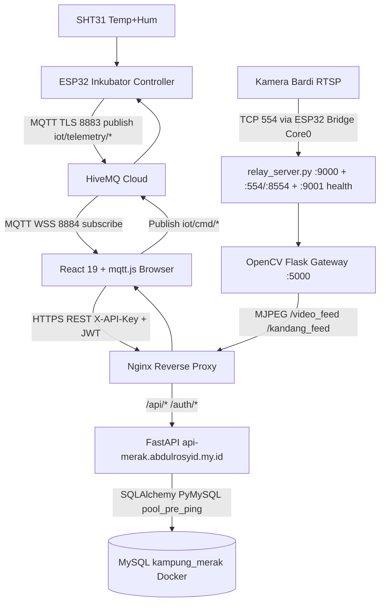
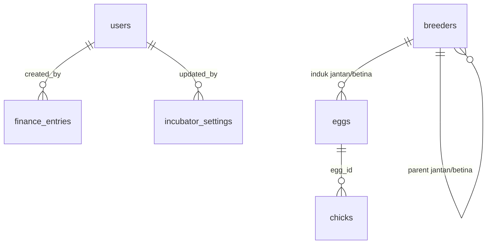

<div align="center">


# 🪶 Kampung Merak — Dashboard Inkubator Telur Merak IoT

**Sistem digitalisasi penangkaran merak: monitoring telemetri real-time, kendali aktuator ESP32, silsilah indukan → telur → anakan, CCTV live, kas & penjualan, dan REST API terpadu.**

</div>

<p align="center">
  <a href="https://github.com/rosyiddd666999/backend-merak"></a>
  
  
  
  
</p>

<p align="center">
  
  
  
  
  
  
  
  
  
  
  
  
</p>

> **Status deploy aktif:** API produksi di `https://api-merak.abdulrosyid.my.id` — dokumentasi interaktif (Swagger UI) tersedia di [`/docs`](https://api-merak.abdulrosyid.my.id/docs).

---

## 📑 Daftar Isi

- [1. Tentang Proyek](#1-tentang-proyek)
- [2. Tangkapan Layar](#2-tangkapan-layar)
- [3. Fitur Utama](#3-fitur-utama)
- [4. Arsitektur Sistem](#4-arsitektur-sistem)
- [5. Tech Stack](#5-tech-stack)
- [6. Struktur Direktori](#6-struktur-direktori)
- [7. Panduan Menjalankan (Development)](#7-panduan-menjalankan-development)
- [8. Konfigurasi Environment](#8-konfigurasi-environment)
- [9. Kontrak MQTT](#9-kontrak-mqtt)
- [10. REST API](#10-rest-api)
- [11. Hak Akses & Peran (RBAC)](#11-hak-akses--peran-rbac)
- [12. Skema Database & Aturan Silsilah](#12-skema-database--aturan-silsilah)
- [13. CCTV / RTSP Gateway](#13-cctv--rtsp-gateway)
- [14. Firmware ESP32](#14-firmware-esp32)
- [15. Deployment Produksi](#15-deployment-produksi)
- [16. Troubleshooting](#16-troubleshooting)
- [17. Roadmap](#17-roadmap)
- [18. Kontribusi](#18-kontribusi)
- [19. Lisensi](#19-lisensi)
- [20. Kredit & Kontak](#20-kredit--kontak)
- [🇬🇧 English Summary](#-english-summary)

---

## 1. Tentang Proyek

**Kampung Merak** adalah dashboard IoT untuk mesin inkubator telur merak. Sistem menggantikan pencatatan manual dengan alur digital ujung-ke-ujung:

- **IoT real-time:** ESP32 + sensor SHT31 mempublish suhu/kelembaban/status aktuator ke HiveMQ Cloud (TLS). Browser berlangganan via MQTT WebSocket Secure (WSS) tanpa me-reload halaman.
- **Kendali jarak jauh:** Lampu pemanas, mist maker (kelembaban), dan motor rak pemutar telur dikendalikan dari web via topik `iot/cmd/*`, dengan mode AUTO/MANUAL di firmware.
- **Silsilah terdokumentasi:** Rantai `Indukan (Breeder) → Telur (Egg) → Anakan (Chick)` dengan ID generatif dan validasi anti-salah-induk.
- **Operasional lengkap:** Manajemen 100 slot inkubator, data indukan, anakan, penjualan, kas (pemasukan/pengeluaran), alert otomatis, dashboard ringkasan, katalog publik, dan CCTV live.
- **Backend modern:** FastAPI + SQLAlchemy + MySQL (Docker), autentikasi ganda `X-API-Key` + JWT, rate-limit (SlowAPI), CORS ketat, dan auto-seed admin & pengaturan inkubator.

Dokumentasi pendalaman tersedia di [`SYSTEM_DOCUMENTATION.md`](SYSTEM_DOCUMENTATION.md), [`docs/backend_api_fastapi_mysql.md`](docs/backend_api_fastapi_mysql.md), [`docs/FLOW.md`](docs/FLOW.md), dan [`RTSP_GUIDE.md`](RTSP_GUIDE.md).

---

## 2. Tangkapan Layar

### 2.1 Backend — Swagger UI (`/docs`)

> Dokumentasi interaktif produksi: [`https://api-merak.abdulrosyid.my.id/docs`](https://api-merak.abdulrosyid.my.id/docs).

| Halaman Utama API | Uji Endpoint Telur |
|---|---|
|  |  |

| Auth & Breeder | Egg, Chick & Incubator |
|---|---|
|  |  |

| Telemetry, Sales & Finance | Dashboard, Alerts & Users |
|---|---|
|  |  |

### 2.2 Frontend — Dashboard Web

> Screenshot frontend menyusul. Folder `screenshots/` saat ini berisi capture backend di atas. Tampilan dashboard mengikuti role yang login (Viewer/Operator/Admin) dari hasil build produksi (`dist/`).

---

## 3. Fitur Utama

### 🌡️ Monitoring & Telemetri
- Kartu suhu/kelembaban live, tren 24 titik, status lampu/mist/motor/sensor, dan log MQTT (`RX/TX/SYSTEM/ERROR`, max 32 baris).
- Throttling cerdas: frontend hanya `POST /api/incubator/status` tiap **60 detik** agar database tidak membengkak.
- Auto-alert: jika suhu/kelembaban keluar dari `incubator_settings`, backend membuat `Alert` (`info/warning/critical`).

### 💡 Kendali Aktuator ESP32
- Lampu (AUTO histeresis + MANUAL_ON/OFF), mist maker (durasi 10 dtk + cooldown 5 dtk, auto saat kelembaban < ambang bawah), motor rak (30 dtk per putaran, auto tiap 4 jam / 240 menit).
- Threshold dapat diubah dari web: `lamp_thresh_on/off`, `humid_thresh_low/high`. Badge hak akses khusus Admin & Operator pada panel kontrol.

### 🥚 Nampan Telur 100 Slot
- Grid visual slot 1–100, status `Fertil / Infertil / Belum dicek` × `Proses / Menetas / Gagal`, estimasi menetas otomatis **tanggalMasuk + 28 hari**.
- **Terakhir rotasi** di-resolve otomatis dari `rotation_logs` sukses terbaru (toleran multi-format timestamp), dengan hardening `503` saat DB tidak tersedia.

### 🧬 Silsilah (Breeder → Egg → Chick)
- ID F0: `JB01` (jantan) / `BB01` (betina); keturunan & telur: `{Jantan}{Betina}-{NN}` cth. `JB01BB02-01`; anakan: `{egg_id}-C{NN}` cth. `JB01BB02-01-C01`.
- Endpoint `lineage` (pohon orang tua rekursif) dan `compare?ids=A,B` (metrik fertilitas & anakan side-by-side, dihitung on-the-fly).
- Aturan edit ketat di `silsilah.py`: field induk terkunci saat PUT, rename hanya suffix, ditolak bila ID dipakai / sudah punya turunan.

### 📹 CCTV Ganda + Health Check
- Feed inkubator (`/video_feed`) & kandang (`/kandang_feed`) via OpenCV MJPEG, proxy Nginx anti mixed-content, endpoint `/cctv_health` + relay status `:9001`.

### 💰 Penjualan, Keuangan & Dashboard
- CRUD Sales (Booking/DP/Lunas), Finance khusus `pemilik` (Pemasukan/Pengeluaran: Pakan, Listrik, Obat, Penjualan), `GET /api/dashboard/summary` (field `finance_summary` hanya untuk `pemilik`).

### 📖 Katalog & 🔐 Akun
- Katalog varietas *Pavo muticus* (Hijau) & *Pavo cristatus* (Biru) + paket unggulan + tombol WhatsApp admin.
- JWT login (`/auth/login`, `/auth/me`), manajemen user khusus `pemilik`, pemetaan role backend `pemilik/staff` → UI `admin/operator`, Viewer tanpa login.

---

## 4. Arsitektur Sistem



**Alur data ringkas:** `Sensor → HiveMQ → React state → UI` (detik), `React → FastAPI → MySQL` (60-detik throttle / CRUD), `Bardi → ESP32 bridge → Relay → OpenCV → Nginx → ` (video).

---

## 5. Tech Stack

| Lapisan | Teknologi | Versi / Keterangan |
|---|---|---|
| Frontend | React, React-DOM, Vite, TailwindCSS, PostCSS, mqtt.js | `19.1.0`, `6.3.5`, `3.4.17`, `5.10.4` — `package.json` |
| Backend | FastAPI, Uvicorn, SQLAlchemy, PyMySQL, Pydantic, python-dotenv, SlowAPI, python-jose, passlib | `fastapi-backend/requirements.txt`, Python `3.12-slim` |
| CCTV Gateway | Flask, OpenCV-Python, python-dotenv | `3.0.3`, `4.10.0.84` — `server/requirements.txt` |
| IoT | ESP32 (WiFi, FreeRTOS Core 0), SHT31 (0x44), PubSubClient, WiFiClientSecure | `esp32/incubator_controller.ino` |
| Broker | HiveMQ Cloud | TLS `8883` (device), WSS `8884/mqtt` (browser) |
| Database | MySQL (Docker `webserver_database`), SQLite fallback lokal bila `MYSQL_HOST` kosong (mode dev lama) | `fastapi-backend/app/database.py` (`pool_pre_ping`, `pool_recycle=3600`) |
| Infra | Nginx reverse proxy (gzip, cache 1y, `proxy_buffering off`), Docker Compose (`database`, `proxy` external) | `nginx.conf`, `Dockerfile`, `docker-compose.yml` |
| Auth | X-API-Key per platform (`API_KEY_WEB/ANDROID`) + JWT Bearer + CORS allowlist + rate-limit | `app/main.py`, `app/auth.py`, `AGENT.md` |

---

## 6. Struktur Direktori

```text
.
├── src/                          # Frontend React 19 + Vite
│   ├── App.jsx                   # Shell, role mapping, sync REST, throttle 60s
│   ├── main.jsx / styles.css
│   ├── components/               # 23 komponen (EggTray, MqttCommandPanel, Sidebar, ...)
│   ├── pages/                    # 13 halaman (Dashboard, Cctv, Egg, Breeders, Chicks,
│   │                             #  Katalog, Sales, Finance, Accounts, Settings, ...)
│   ├── hooks/useMqttBridge.js    # Klien mqtt.js (connect/subscribe/publish/log)
│   ├── utils/api.js              # fetchApi (X-API-Key + JWT)
│   └── data/constants.js         # Topik MQTT, ROLES, VARIETAS, initial data
├── fastapi-backend/              # REST API Python
│   ├── app/
│   │   ├── main.py               # Lifespan seed, CORS, X-API-Key middleware, routers
│   │   ├── database.py           # Engine MySQL (wajib MYSQL_HOST/USER/PASSWORD/DATABASE)
│   │   ├── models.py             # 11 tabel SQLAlchemy
│   │   ├── schemas.py            # Pydantic request/response
│   │   ├── auth.py / silsilah.py # JWT + require_role + aturan ID silsilah
│   │   └── routers/              # auth, breeders, eggs, chicks, incubator,
│   │                             # sales, finance, dashboard, alerts, users (11 file)
│   ├── Dockerfile                # python:3.12-slim + uvicorn :8000
│   ├── requirements.txt
│   └── .env.example              # Template tersanitasi (placeholder)
├── server/                       # Video gateway
│   ├── relay_server.py           # TCP relay ESP32 :9000, RTSP :554/:8554, health :9001
│   ├── rtsp_gateway_example.py   # OpenCV RTSP → MJPEG :5000
│   ├── requirements.txt
│   └── .env.example              # Template RTSP tersanitasi
├── esp32/
│   └── incubator_controller.ino  # Firmware (SHT31, relay 25/27/26, HiveMQ, RTSP bridge)
├── docs/
│   ├── backend_api_fastapi_mysql.md
│   └── FLOW.md
├── public/logo.png
├── screenshots/                  # main-display, get-eggs, tampilan1-4 (backend Swagger)
├── nginx.conf / Dockerfile / docker-compose.yml
├── deploy.py / deploy_to_edy.py  # Deploy SFTP/SSH otomatis
├── vite.config.js                # Proxy /api,/auth → api-merak... ; /video_feed → :5000
├── SYSTEM_DOCUMENTATION.md / RTSP_GUIDE.md / AGENT.md
└── README.md / LICENSE
```

> Catatan migrasi (`5ac6c21`): direktori legasi `backend/` (Express + SQLite `kampung-merak.db`) telah **dihapus**. Jangan lagi merujuk `BACKEND_FIXX.md / FRONTEND.md / MOBILE.md` yang sudah dibersihkan dari repo.

---

## 7. Panduan Menjalankan (Development)

### Prasyarat
- Node.js 20+, Python 3.12+, MySQL 8 (atau Docker), akses HiveMQ Cloud, satu kamera RTSP di LAN yang sama.

### 7.1 Backend — FastAPI + MySQL
```bash
cd fastapi-backend
python -m venv venv && source venv/bin/activate   # Windows: .\venv\Scripts\activate
pip install -r requirements.txt
cp .env.example .env   # isi MYSQL_*, API_KEY_*, JWT_SECRET, CORS_ORIGINS, FIRST_ADMIN_*
# pastikan database kampung_merak sudah dibuat
uvicorn app.main:app --reload --host 0.0.0.0 --port 8000
# Swagger: http://localhost:8000/docs
```
Startup otomatis: `Base.metadata.create_all`, seed 1 baris `incubator_settings` (37.0–38.0 °C, 55–65 %, rotasi 240 mnt), dan seed `USR-001` bila `FIRST_ADMIN_EMAIL/PASSWORD` diisi.

### 7.2 CCTV Gateway — Relay + OpenCV
```bash
# Terminal 1 — relay TCP (wajib dulu untuk ESP32 bridge)
python server/relay_server.py
# → ESP :9000, RTSP :554/:8554, health :9001/status

# Terminal 2 — gateway MJPEG
cd server
pip install -r requirements.txt
cp .env.example .env   # isi INCUBATOR_RTSP_URL, KANDANG_RTSP_URL (placeholder)
python rtsp_gateway_example.py
# → http://localhost:5000/video_feed
```

### 7.3 Frontend — React + Vite
```bash
npm install
cp .env.example .env   # isi VITE_MQTT_*, VITE_API_BASE_URL, VITE_API_KEY_WEB, ...
npm run dev            # → http://localhost:5173
npm run build          # → dist/ (di-track untuk deploy langsung ke STB)
```
`vite.config.js` mem-proxy `/api,/auth → https://api-merak.abdulrosyid.my.id` agar bebas CORS saat dev, dan `/video_feed → http://127.0.0.1:5000`.

---

## 8. Konfigurasi Environment

> Nilai di bawah adalah **placeholder**. Jangan commit kredensial asli. File `.env` sudah di-ignore (`.gitignore`). Contoh nyata yang lama (HiveMQ cluster, user, password, IP kamera, SSID WiFi) **sengaja tidak ditampilkan**.

**Frontend (`/.env.example`):**
```env
VITE_MQTT_URL=wss://<your-hivemq-cluster>.s1.eu.hivemq.cloud:8884/mqtt
VITE_MQTT_USERNAME=<mqtt-username>
VITE_MQTT_PASSWORD=<mqtt-password>
VITE_RTSP_MJPEG_URL=/video_feed
VITE_INKUBASI_START=2026-06-02T07:00:00
VITE_ADMIN_ACCESS_CODE=<admin-code>
VITE_OPERATOR_ACCESS_CODE=<operator-code>
VITE_API_BASE_URL=https://api-merak.abdulrosyid.my.id
VITE_API_KEY_WEB=<api-key-web>
```

**Backend (`/fastapi-backend/.env.example`):**
```env
MYSQL_HOST=<mysql-host>
MYSQL_PORT=3306
MYSQL_DATABASE=kampung_merak
MYSQL_USER=<mysql-user>
MYSQL_PASSWORD=<mysql-password>
API_KEY_WEB=<api-key-web>
API_KEY_ANDROID=<api-key-android>
JWT_SECRET=<jwt-secret-min-32-char>
CORS_ORIGINS=https://<domain-prod-anda>
FIRST_ADMIN_EMAIL=<admin-email>
FIRST_ADMIN_PASSWORD=<admin-password>
MQTT_URL=wss://<your-hivemq-cluster>.s1.eu.hivemq.cloud:8884/mqtt
MQTT_USERNAME=<mqtt-username>
MQTT_PASSWORD=<mqtt-password>
```

**Gateway (`/server/.env.example`):**
```env
INCUBATOR_RTSP_URL=rtsp://<user>:<password>@<ip-kamera>:<port>/V_ENC_000
KANDANG_RTSP_URL=rtsp://<user>:<password>@<ip-kamera-kandang>:<port>/stream1
```

**Firmware (`esp32/`):** kredensial WiFi, HiveMQ, IP Bardi, dan host relay didefinisikan di awal `.ino` — ganti dengan nilai lokal Anda saat flashing, jangan commit ulang nilai pribadi.

---

## 9. Kontrak MQTT

Broker: HiveMQ Cloud — device `8883/TLS`, browser `8884/WSS`. QoS 0, `clean:true`, `keepalive:30`, auto-reconnect 3 dtk.

| Arah | Topik | Payload | Sumber |
|---|---|---|---|
| Publish (device→web) | `iot/telemetry/temperature` | `37.8` (°C, 1 desimal, tiap 5 dtk) | `.ino:371` |
|  | `iot/telemetry/humidity` | `48.2` (%, 1 desimal) | `.ino:375` |
|  | `iot/telemetry/status_lamp` | `ON`/`OFF` | `.ino:378` |
|  | `iot/telemetry/status_mist` | `ON`/`OFF` | `.ino:379` |
|  | `iot/telemetry/status_motor` | `ON`/`OFF` | `.ino:380` |
|  | `iot/telemetry/status_sensor` | `OK`/`ERROR` | `.ino:377` |
| Subscribe (web→device) | `iot/cmd/lamp_thresh_on` | `37.5` (float) | `constants.js:11` |
|  | `iot/cmd/lamp_thresh_off` | `38.0` (float) | `constants.js:12` |
|  | `iot/cmd/humid_thresh_low` | `40.0` (float) | `constants.js:13` |
|  | `iot/cmd/humid_thresh_high` | `70.0` (float) | `constants.js:14` |
|  | `iot/cmd/lamp_mode` | `ON`/`OFF`/`AUTO` | `constants.js:15` |
|  | `iot/cmd/mist_trigger` | `TRIGGER` | `constants.js:18` |
|  | `iot/cmd/motor_trigger` | `TRIGGER` | `constants.js:17` |

Topik tambahan di frontend (`motor_turns`, `candling_mode`, `alert_ack`) dicadangkan untuk ekstensi firmware berikutnya.

---

## 10. REST API

Base prod: `https://api-merak.abdulrosyid.my.id` — **semua request wajib header `X-API-Key`**, endpoint bertanda 🔒 wajib JWT Bearer. Swagger: `/docs`.

```bash
# Publik (cukup API Key)
curl -H "X-API-Key: <api-key-web>" https://api-merak.abdulrosyid.my.id/api/eggs
curl -H "X-API-Key: <api-key-web>" https://api-merak.abdulrosyid.my.id/api/incubator/status

# Login lalu pakai token
curl -X POST https://api-merak.abdulrosyid.my.id/auth/login \
  -H "Content-Type: application/json" -H "X-API-Key: <api-key-web>" \
  -d '{"email":"<admin-email>","password":"<admin-password>"}'
curl -H "X-API-Key: <api-key-web>" -H "Authorization: Bearer <jwt>" \
  https://api-merak.abdulrosyid.my.id/api/finance
```

| Modul | Method & Endpoint | Akses |
|---|---|---|
| Auth | `POST /auth/login`, `GET /auth/me` | publik / login |
|  | `POST /auth/register` | 🔒 `pemilik` |
| Breeder | `GET /api/breeders`, `GET /api/breeders/{id}` | publik |
|  | `POST /api/breeders`, `PUT /api/breeders/{id}` | 🔒 `pemilik,staff` |
|  | `DELETE /api/breeders/{id}` | 🔒 `pemilik` |
|  | `GET /api/breeders/{id}/lineage`, `GET /api/breeders/compare?ids=A,B` | publik |
| Egg | `GET /api/eggs` | publik |
|  | `POST /api/eggs`, `PUT /api/eggs/{id}` | 🔒 `pemilik,staff` |
|  | `DELETE /api/eggs/{id}` | 🔒 `pemilik` |
| Chick | `GET /api/chicks` | publik |
|  | `POST/PUT /api/chicks[/{id}]` | 🔒 `pemilik,staff` |
|  | `DELETE /api/chicks/{id}` | 🔒 `pemilik` |
| Incubator | `GET /api/incubator/settings`, `GET /api/incubator/status`, `GET /api/incubator/telemetry-logs`, `GET /api/incubator/rotation-logs` | publik |
|  | `PUT /api/incubator/settings` | 🔒 `pemilik,staff` |
|  | `POST /api/incubator/status`, `POST /api/incubator/telemetry-logs`, `POST /api/incubator/rotation-logs` | device/internal (API Key) |
| Sales | `GET /api/sales` | publik |
|  | `POST/PUT /api/sales[/{id}]` | 🔒 `pemilik,staff` |
|  | `DELETE /api/sales/{id}` | 🔒 `pemilik` |
| Finance | `GET/POST/PUT/DELETE /api/finance[/{id}]` | 🔒 `pemilik` |
| Dashboard | `GET /api/dashboard/summary` | 🔒 `pemilik,staff` (`finance_summary` hanya `pemilik`) |
| Alerts | `GET /api/alerts`, `PUT /api/alerts/{id}/read` | 🔒 `pemilik,staff` |
|  | `DELETE /api/alerts/{id}` | 🔒 `pemilik` |
| Users | `GET/PUT/DELETE /api/users[/{id}]` | 🔒 `pemilik` |

Spesifikasi Pydantic lengkap: `fastapi-backend/app/schemas.py`. Urutan middleware: `RateLimit → CORS → X-API-Key → JWT+Role → logic` (`AGENT.md §8`).

---

## 11. Hak Akses & Peran (RBAC)

| Modul | Pemilik (backend) / Admin (UI) | Staff / Operator | Publik / Viewer (tanpa login) |
|---|---|---|---|
| Dashboard, CCTV, Telur view, Indukan view, Anakan view, Katalog | ✅ | ✅ | ✅ (read-only) |
| Kontrol aktuator, threshold, CCTV config | ✅ | ✅ | ❌ dikunci |
| CRUD Breeder/Egg/Chick/Sales (create/update) | ✅ | ✅ | ❌ |
| Delete Breeder/Egg/Chick/Sales | ✅ | ❌ | ❌ |
| Finance | ✅ CRUD | ❌ | ❌ |
| Dashboard summary | ✅ (+finance) | ✅ (tanpa finance) | ❌ |
| Alerts view/ack | ✅ | ✅ | ❌ |
| Alerts delete, User management, Register | ✅ | ❌ | ❌ |

Login UI: ikon kunci di sidebar → JWT disimpan di `localStorage` (`jwt_token`), role backend dipetakan (`pemilik/admin→admin`, `staff/operator→operator`), fallback kode akses lokal `VITE_ADMIN/OPERATOR_ACCESS_CODE` untuk mode demo.

---

## 12. Skema Database & Aturan Silsilah

Tabel (`fastapi-backend/app/models.py`): `users`, `breeders`, `eggs`, `chicks`, `incubator_settings` (1 baris global), `incubator_status` (append-only), `telemetry_logs`, `rotation_logs`, `sales`, `finance_entries`, `alerts`.



Aturan ID (`silsilah.py`): kosong saat POST = auto-generate per pasangan/per telur; prefix lama (`MRK-*`, `EGG-*`, `CHK-*`) tetap diterima (legacy bypass); `jenis_kelamin/parent_*/induk_*/egg_id` terkunci saat PUT; rename hanya suffix nomor. Migrasi terkait: `migrasi_silsilah.sql`, `migrasi_incubator_terakhir_rotasi.sql`.

---

## 13. CCTV / RTSP Gateway

1. **Relay (`relay_server.py`):** terima ESP32 di `:9000`, layani OpenCV di `:554/:8554`, health JSON di `:9001/status|/health|/cctv_health` (`esp_connected`, `active_clients`). Deteksi cerdas: sesi 0-byte dianggap TCP ping dan **tidak** mereset ESP32.
2. **Gateway (`rtsp_gateway_example.py`):** OpenCV baca RTSP → resize/kompresi JPEG → Flask multipart `multipart/x-mixed-replace` di `:5000/video_feed` (+ `/kandang_feed`, `/health`).
3. **Nginx:** `/video_feed`, `/kandang_feed`, `/cctv_health` di-proxy ke `cctv-gateway:5000` dengan `proxy_buffering off` + timeout 86400s; frontend cukup pakai path relatif `/video_feed` agar lolos mixed-content HTTPS. Detail: [`RTSP_GUIDE.md`](RTSP_GUIDE.md).

---

## 14. Firmware ESP32

File: `esp32/incubator_controller.ino` — buka di Arduino IDE, install `PubSubClient` + `Adafruit SHT31`, pilih board ESP32.

- **Pin:** Lampu `25`, Mist `27`, Motor `26` (`RELAY_ON=HIGH`).
- **Sensor:** SHT31 `0x44` (SDA 21, SCL 22), baca tiap 2 dtk, publish tiap 5 dtk bila valid.
- **Kontrol:** lampu histeresis AUTO (`temp_thresh_on 37.5` / `off 38.0`), mist auto bila `humidity < humid_thresh_low` (default 40.0, atas 70.0), motor auto tiap 4 jam; semua threshold & mode dapat dioverride via MQTT (lihat §9).
- **RTSP bridge:** task FreeRTOS pinned Core 0, buffer 2 KB, jembatan dua arah kamera ↔ relay server dengan auto-reconnect WiFi/MQTT.
- **Konfigurasi:** ganti placeholder SSID, `mqtt_server/port/user/pass`, `bardi_ip/port`, `server_host/port` di 30 baris pertama sebelum upload. Jangan commit nilai asli.

---

## 15. Deployment Produksi

```bash
npm run build          # hasil ke dist/ (di-track untuk STB)
python deploy.py       # atau: python deploy_to_edy.py
```

`deploy.py` mengemas `dist/ + fastapi-backend/ + server/ + nginx.conf`, upload via SFTP, ekstrak, rebuild Docker, restart kontainer, dan cek HTTP. Komponen:

- **Frontend:** `Dockerfile` (`nginx:alpine`, copy `dist/` + `nginx.conf`, `chmod 755`, expose 80) dengan gzip + cache aset 1 tahun (`index.html` no-cache) + proxy `/api/,/auth/,/video_feed,/kandang_feed,/cctv_health`.
- **API:** `fastapi-backend/Dockerfile` (`python:3.12-slim`, `uvicorn :8000`), `docker-compose.yml` (service `api`, network external `webserver_database` + `webserver_proxy`, `env_file: fastapi-backend/.env`, `restart: unless-stopped`).

---

## 16. Troubleshooting

| Gejala | Penyebab umum | Solusi |
|---|---|---|
| `401 X-API-Key tidak valid` | Header kurang/salah | Kirim `X-API-Key: <API_KEY_WEB>` di semua request; samakan dengan backend `.env` |
| `503 Database inkubator tidak tersedia` | `MYSQL_*` salah / pool putus | Cek `docker network`, `MYSQL_HOST/USER/PASSWORD/DATABASE`, `pool_pre_ping`; lihat log `merak` |
| `RuntimeError: MySQL configuration is incomplete` | Env belum diisi | Lengkapi 4 var wajib di `fastapi-backend/.env` |
| MQTT `error/offline` di UI | URL WSS salah / kredensial / firewall | Pakai `wss://...:8884/mqtt` untuk browser (bukan `1883`), cek user/pass, buka DevTools → Network WS |
| CORS ditolak | Origin belum allowlist | Tambah domain ke `CORS_ORIGINS` backend; dev gunakan proxy Vite |
| `429 Too Many Requests` | Kena SlowAPI rate-limit | Kurangi frekuensi polling / naikkan limit per IP/key |
| CCTV blank | IP kamera berubah / relay belum jalan | `ping <ip-kamera>`, pastikan `relay_server.py` dulu baru gateway, gunakan static IP/DHCP reservation |
| Video patah-patah | Resolusi Bardi tinggi | Pastikan `cv2.resize` + `proxy_buffering off` di Nginx |
| ESP32 churn (connect/disconnect) | TCP ping dianggap putus | Sudah ditangani (0-byte = ping, sesi dipertahankan) — update ke `relay_server.py` terbaru |
| `Slot sudah terisi` / `422` silsilah | Slot duplikat / ganti induk dilarang | Pakai slot 1–100 unik; rename hanya suffix nomor |

---

## 17. Roadmap

- [ ] Play Integrity (Android) + token integrity untuk endpoint sensitif (`AGENT.md §8.2`)
- [ ] Sertifikat keaslian + QR silsilah (DCA)
- [ ] Multi-inkubator (saat ini 1 unit fisik)
- [ ] Peringatan inbreeding di breeder compare
- [ ] Push notification (FCM/OneSignal) — saat ini polling `/api/alerts`
- [ ] Test otomatis backend (`pytest`) & E2E frontend

---

## 18. Kontribusi

1. Fork repo `rosyiddd666999/backend-merak`, buat branch `feat/<nama-fitur>`.
2. Ikuti `AGENT.md` sebagai source of truth (JS: `npm run build` lolos; Python: hormati `require_role` + `silsilah.py`).
3. Jangan commit `.env`, kredensial, atau `venv/node_modules`. Gunakan placeholder di `.env.example`.
4. Buka PR dengan deskripsi jelas + screenshot bila menyentuh UI. PR welcome!

---

## 19. Lisensi

Proyek ini dilisensikan di bawah **MIT License** — lihat file [`LICENSE`](LICENSE). Bebas dipakai, dimodifikasi, dan didistribusikan dengan mencantumkan atribusi.

---

## 20. Kredit & Kontak

- **Repository utama:** [rosyiddd666999/backend-merak](https://github.com/rosyiddd666999/backend-merak)
- **Kontributor:** [PrasetyaRiski/kampung_merak](https://github.com/PrasetyaRiski/kampung_merak)
- **API produksi:** [`https://api-merak.abdulrosyid.my.id`](https://api-merak.abdulrosyid.my.id) — Swagger: [`/docs`](https://api-merak.abdulrosyid.my.id/docs)
- **Tim:** Kampung Merak & Mitra Pengembang — modul IoT, backend, frontend, dan firmware ESP32.

---

## 🇬🇧 English Summary

**Kampung Merak** is an IoT dashboard for peacock-egg incubators: live telemetry (ESP32 + SHT31 → HiveMQ → React WSS), remote actuator control (heater lamp, mist maker, egg-tray motor with adjustable thresholds), pedigree tracking (`Breeder → Egg → Chick` with generative IDs), dual CCTV live feeds (Bardi RTSP → ESP32 bridge → TCP relay → OpenCV MJPEG → Nginx), sales/finance, and a hardened FastAPI + MySQL backend (`X-API-Key` + JWT, CORS, rate-limit). Main repo: `rosyiddd666999/backend-merak` (contributor: `PrasetyaRiski/kampung_merak`), production API: `https://api-merak.abdulrosyid.my.id`, license: MIT. See sections above for architecture, MQTT contract, REST endpoints, RBAC matrix, and deployment.
